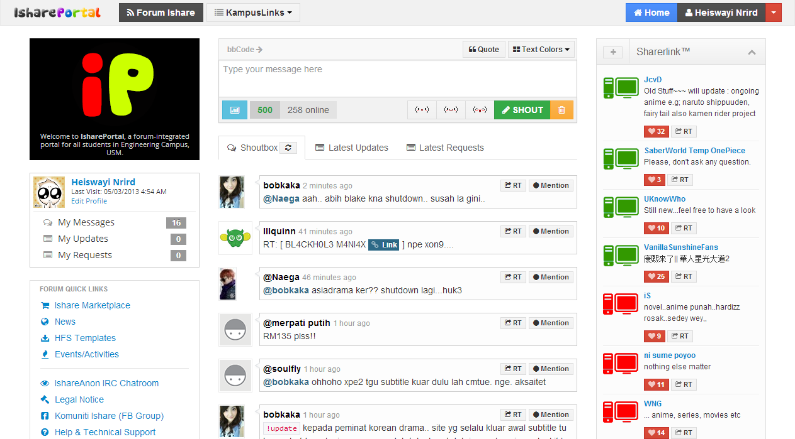
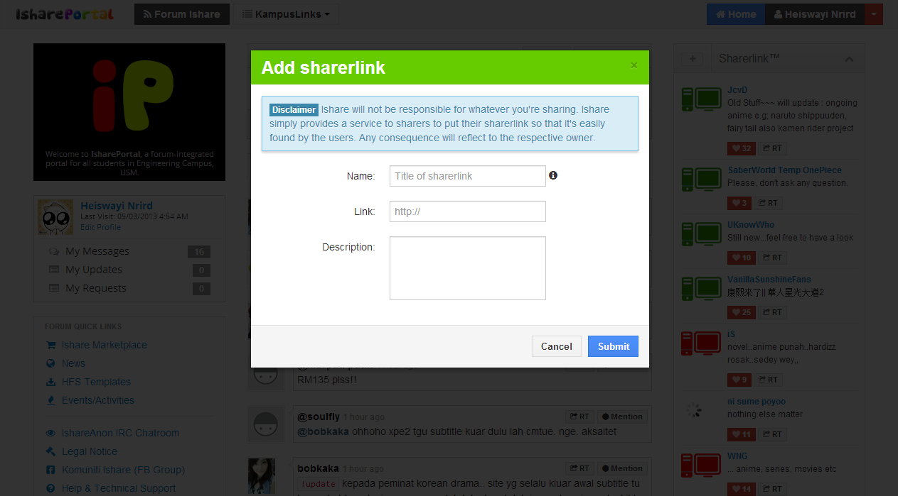
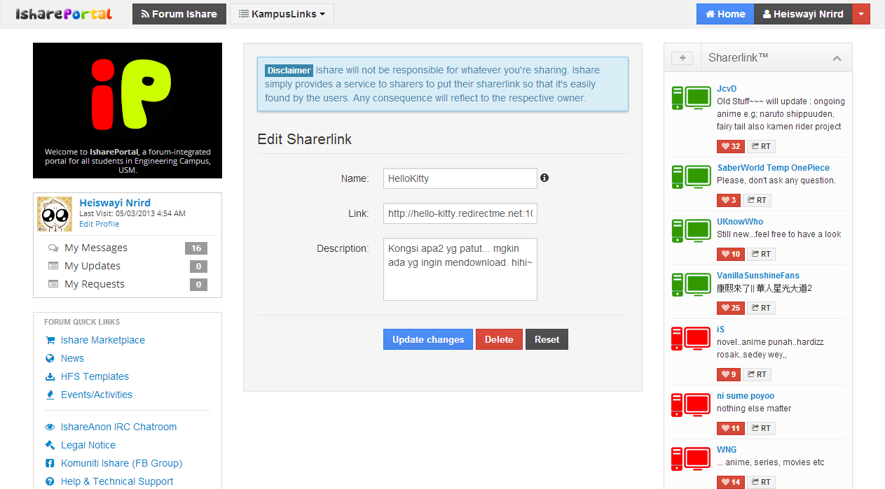
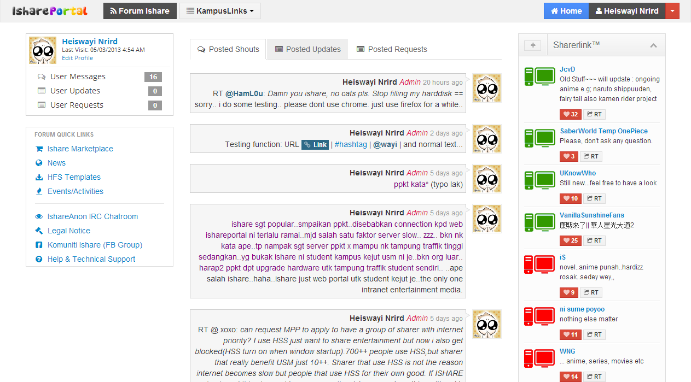
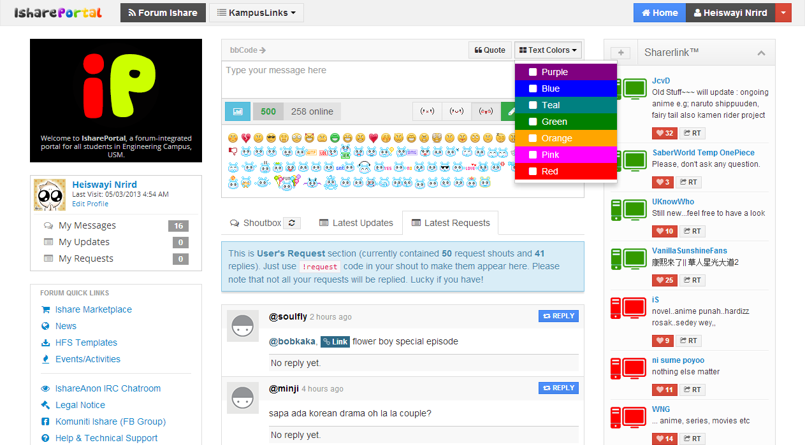
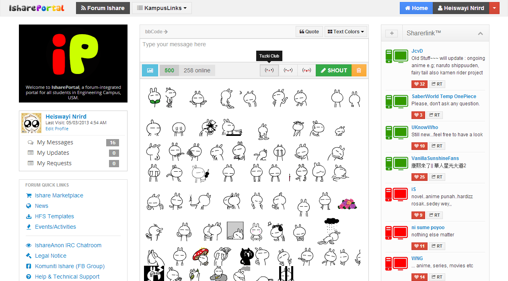
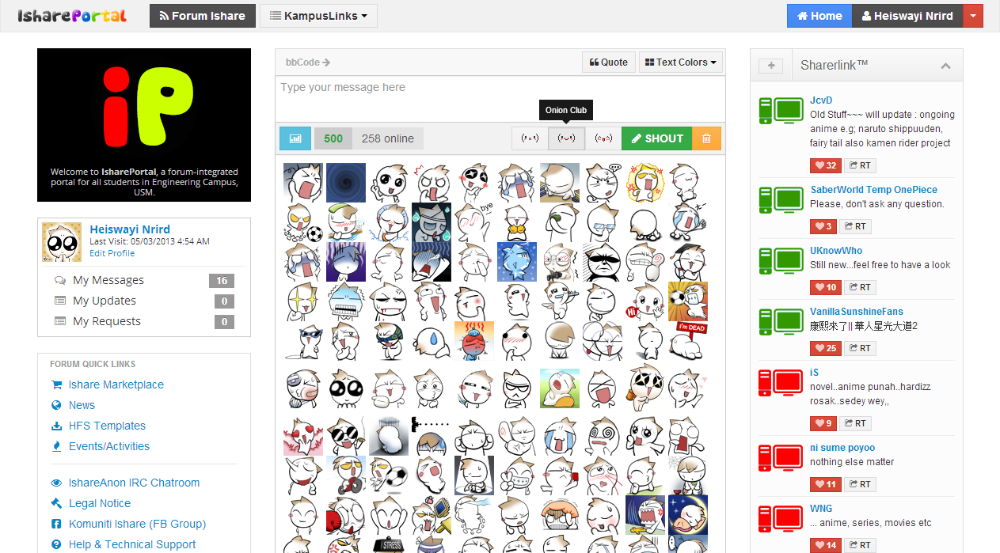

# ishareportal

[DEPRECATED] IsharePortal's Source Code

## About

IsharePortal was a platform for students sharing community in Universiti Sains Malaysia Engineering Campus, established in February 2010 and lasted until March 2013. Originated from "Ishare", a simple WordPress-based site that gathered all sharing servers (popularly known as sharerlinks afterward) from all available sharers and sorted in that one place, so people were easily to find them. Then, Ishare started to have its own loyal users then became a progressive community in the campus. From there, Ishare started to grow faster. Since then, from time to time, I started to revamp the website and built it from scratch in PHP and MySQL.

And this development wasn't just stop there, I kept improving it until we had our own shoutbox (or chatbox) with our own choice of emoticons (Tuzki & Onion Head Club emoticons) built using jQuery for AJAX processing. Then, I started to continue to implement auto-check feature for online-offline for each sharerlink, where this feature became the most important feature in IsharePortal. In full version, IsharePortal actually already was a CMS where the user management system has been integrated with a PunBB forum system. Whatever it is, Ishare Shoutbox and Ishare Sharerlink Auto-Check are the major features that contributed to the success of IsharePortal.

**For Sharers. By Sharers.**

## The Shutdown

Due to high tension controversy, and I admitted it about its pros and cons, I decided to shut down IsharePortal on March 12, 2013 effectively. You may [read the shutdown notice here](http://heiswayi.github.io/ishare-in-memory/) [(source code available here)](https://github.com/heiswayi/ishare-in-memory) - it's a special webpage I created and used as a shutdown webpage in IsharePortal URL.

Even though the main portal was shutting down, I created a simple script, a compact version of sharerlink system known as [iLink](https://github.com/heiswayi/ilink) to enable the sharers to continue to promote their sharerlinks to the community. Nothing was special, just a place to put the sharerlinks with auto-check feature for online-offline status of the sharerlink.

## Screenshots

_Screenshot 1_

_Screenshot 2_

_Screenshot 3_

_Screenshot 4_

_Screenshot 5_

_Screenshot 6_

_Screenshot 7_

## License

Please NOTE that, the Source Code might not follow any coding standard except for the forum and the code might be messy. As for PHP 5.5.0, some code may be DEPRECATED. The Source Code is licensed under [MIT license](http://heiswayi.github.io/mit-license).
